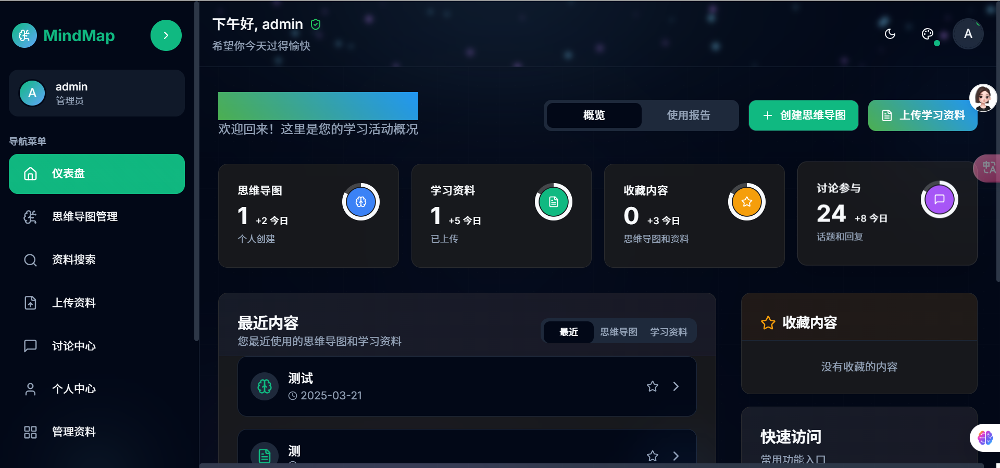

# 🧠 思维导图共享平台

<p align="center">
  
</p>

## 📖 项目简介

**思维导图共享平台**是一个专门为学习者设计的知识整理与分享平台。用户可以创建思维导图、上传学习资料、通过标签搜索内容，并与其他学习者交流讨论。

### 🎯 设计目标

- 为学习者提供一个直观的知识组织工具
- 促进知识的共享与交流
- 建立一个活跃的学习社区
- 通过可视化的方式展示知识结构，提高学习效率

## ✨ 主要功能

- 🗺️ **思维导图创建与管理** - 轻松创建和管理思维导图，整理知识结构和思路
- 📚 **学习资料分享** - 上传和分享学习资料，添加标签便于分类和查找
- 🔍 **标签化思维导图搜索** - 通过标签搜索学习资料，以思维导图形式呈现结果
- 💬 **讨论交流** - 就学习话题展开讨论，与其他用户交流经验和想法
- 👥 **社区互动** - 加入学习社区，结交志同道合的朋友，共同进步
- 👤 **用户角色管理** - 支持普通用户和管理员角色，管理员可管理平台资料和用户

## 🛠️ 技术栈

本项目使用以下技术开发：

- ⚡ **[Vite](https://vitejs.dev/)** (v4.x) - 现代前端构建工具，提供极速的开发体验
- ⚛️ **[React](https://reactjs.org/)** (v18.x) - 用于构建用户界面的 JavaScript 库
- 📘 **[TypeScript](https://www.typescriptlang.org/)** (v5.x) - JavaScript 的超集，提供类型检查
- 🎨 **[Tailwind CSS](https://tailwindcss.com/)** (v3.x) - 实用优先的 CSS 框架
- 🧩 **[Shadcn UI](https://ui.shadcn.com/)** - 高质量的 React 组件库
- 🧭 **[React Router](https://reactrouter.com/)** (v6.x) - React 应用的声明式路由
- 🎬 **[Framer Motion](https://www.framer.com/motion/)** - 强大的 React 动画库
- 💾 **LocalStorage** - 浏览器本地数据存储

## 📷 项目截图

<p align="center">
  
</p>

## 🚀 如何运行

1. 克隆仓库

```sh
git clone https://github.com/zengyi-thinking/mindmap-hub-shared.git
```

2. 安装依赖

```sh
cd mindmap-hub-shared
npm install
```

3. 启动开发服务器

```sh
npm run dev
```

4. 访问本地开发服务器

```
http://localhost:8080
```

5. 构建项目并预览

```sh
npm run build
npm start
```

## 🌐 部署信息

该项目已部署在 GitHub Pages 上，可通过以下链接访问：

**🔗 在线体验地址**: [https://zengyi-thinking.github.io/mindmap-hub-shared/](https://zengyi-thinking.github.io/mindmap-hub-shared/)

### 📦 GitHub Pages 部署步骤

1. 构建项目

```sh
npm run build
```

2. 推送代码到 GitHub

```sh
git add .
git commit -m "Update build for GitHub Pages"
git push
```

3. GitHub Actions 会自动部署最新代码到 GitHub Pages
   - 部署工作流配置在 `.github/workflows/deploy.yml`
   - 构建后的文件会被部署到 `gh-pages` 分支

## ❓ 常见问题解决

### "npm start"脚本找不到

如果遇到 "Missing script: start" 错误，请确保 package.json 中包含了 start 脚本：

```json
"scripts": {
  "start": "vite preview --port 8080"
}
```

### 部署后资源路径错误

确保 vite.config.ts 中设置了正确的 base 路径：

```ts
base: '/mindmap-hub-shared/', // 替换为你的GitHub仓库名
```

## 👥 用户指南

### 普通用户账号

- 可以通过注册功能创建新账号
- 可以查看和创建思维导图、上传学习资料、参与讨论等

### 管理员账号

- 用户名: `admin`
- 密码: `000000`
- 拥有所有普通用户权限，并可以管理平台资料和用户

## 🤝 贡献指南

我们欢迎所有形式的贡献，无论是新功能、bug 修复还是文档改进。请遵循以下步骤：

1. Fork 本仓库
2. 创建您的特性分支 (`git checkout -b feature/amazing-feature`)
3. 提交您的更改 (`git commit -m 'Add some amazing feature'`)
4. 推送到分支 (`git push origin feature/amazing-feature`)
5. 打开一个 Pull Request

## 📄 许可证

本项目采用 MIT 许可证 - 详情请参阅 [LICENSE](LICENSE) 文件

## AI 助手功能

思维导图中心集成了智能 AI 助手，帮助用户理解和创建思维导图。

### 主要功能

- **智能对话**: 用户可以与 AI 助手进行对话，获取关于思维导图的建议和帮助
- **多种 AI 服务支持**: 支持 OpenAI、DeepSeek、豆包等多种 AI 服务提供商，您可以自由选择
- **本地回复功能**: 无需 API 密钥也能获得基本的回复支持
- **API 密钥设置**: 支持用户设置自己的 API 密钥，确保数据安全和隐私
- **多种模型选择**: 针对不同提供商，支持选择不同的模型类型
- **多种交互方式**: 支持简单悬浮按钮和带预览气泡的两种交互方式
- **可拖拽定位**: AI 助手悬浮球可以拖拽到屏幕任意位置，并记住上次的位置
- **响应式设计**: 适配各种屏幕尺寸，确保最佳的用户体验

### 使用方法

1. 点击屏幕右下角的悬浮 AI 助手图标，打开对话界面
2. 输入你关于思维导图的问题或需求
3. AI 助手会提供相关的回答和建议
4. 点击设置图标，可以选择不同的 AI 服务提供商，并配置相应的 API 密钥

### 支持的 AI 服务提供商

- **本地模式**: 无需 API 密钥，使用预设回复
- **OpenAI**: 支持 GPT-3.5 Turbo、GPT-4、GPT-4 Turbo 等模型
- **DeepSeek**: 支持 DeepSeek Chat、DeepSeek Coder 等模型
- **豆包**: 支持豆包 Lite、豆包 Pro 等模型

### 技术实现

- 使用 React 和 TypeScript 构建前端界面
- 使用 Framer Motion 实现平滑的动画和拖拽效果
- 集成多种 AI API 服务，支持统一的对话接口
- 使用本地存储保存用户设置和位置信息，确保数据隐私

---

<p align="center">用思维导图，让学习更高效！</p>
